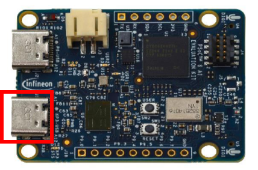

# Welcome to the Hackathon of our PhD Cup 2025

## Hardware
- PSOC™ 6 AI Evaluation Kit
- A Type C cable
- A laptop

## Software
Each AI Evaliation Kit has been flashed with our Radar Gesture Recognition Application, we provided example [code](./main.py) for you to start with. All you need to do now is to connect the kit and your laptop with a type C cable using the I/O illustrated below. Then, you should be able to run the example code:
```
## 1. Create virutal env, the program has been tested with python 3.9/3.10
## 2. Enter your virtual env
## 3. pip install pyserial
## 4. Execute the main.py

## Window
python main.py COM15 ## replace COM15 wiht your device name
## Ubuntu
python main.py /dev/ttyACM0
```



## Objective
- Make something cool
- Make something helpful 
- Enjoy teamwork!!!
